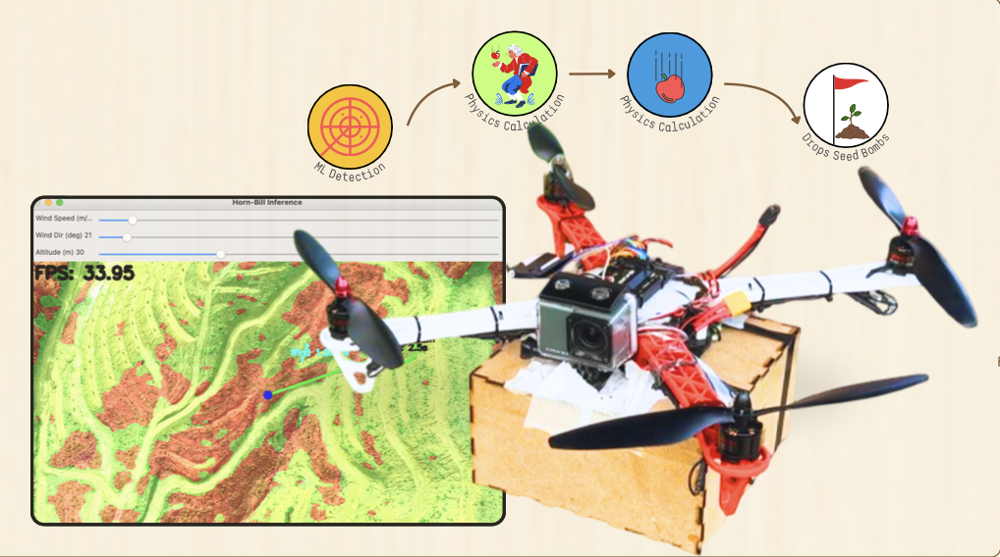
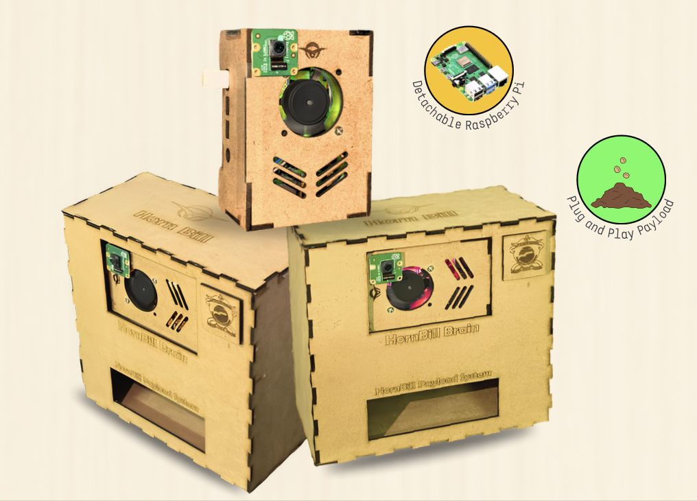

# 🌱 Horn-Bill: AI-Powered Reforestation Drone  

Horn-Bill is an **autonomous drone system** designed to accelerate **reforestation** by identifying barren patches of land and precisely dropping **eco-friendly seed bombs**.  
Built on **AI + Raspberry Pi + Robotics**, Horn-Bill combines aerial intelligence with sustainable design to address one of humanity’s most urgent challenges — **climate change and deforestation**.  

---

## 🛩️ The Drone  

  

- Fixed-wing/Quadcopter design with **1.5 kg payload capacity**.  
- Supports **Autopilot (ArduPilot) for autonomous flight** and manual flight modes.  
- Configured for stable, long-endurance reforestation missions.  

---

## 📦 The Payload System  

  

- **CNC-cut payload box** with detachable Raspberry Pi mount for easy upgrades.  
- **Servo-lever mechanism** for accurate seed release.  
- Quick-attach wooden payload bay for flexibility and maintenance.  

---

## 🤖 AI Model  

- Runs on **Raspberry Pi with PiCam/USB camera**.  
- Uses **Roboflow vegetation segmentation model** to identify:  
  - Green zones (vegetation).  
  - Non-vegetation patches (ideal drop zones).  
- **Wind + altitude compensation**: physics-based model predicts drift to ensure seeds land precisely.  
- Real-time overlays showing “safe drop zones.”  

---

## 🌱 The Seed Bombs  

- Handmade, eco-friendly **clay–compost seed balls** (~3 cm).  
- Contain seeds + nutrients + moisture for protection and germination.  
- Weight optimized (~10 g) to reduce air resistance and ensure accurate drops.  
- Disperse seeds upon ground impact for **maximum coverage**.  

---

## 🧭 How Horn-Bill Works  

1. **Take-off & Stabilization**  
   - Drone lifts off and enters stabilization mode (locks altitude for accuracy).  

2. **AI Vision Processing**  
   - Camera feed processed on Raspberry Pi.  
   - Vegetation model segments land, inverts mask to highlight barren zones.  

3. **Drop Decision**  
   - Wind speed & direction provided via **anemometer input**.  
   - Physics module adjusts drop coordinates.  
   - If target zone is clear (within radius), system marks it as droppable.  

4. **Seed Release**  
   - On user confirmation → servo triggers payload release.  
   - Eco-seed bomb falls, disperses seeds on ground.  

---

## 🖥️ Simulation Mode (MVP)  

Since flying drones isn’t always allowed indoors/competitions, Horn-Bill runs a **simulation pipeline** on a Mac/RPi:  
- Load aerial images/videos → segmentation + drop logic simulated.  
- User can adjust wind speed, direction, and altitude via UI sliders.  
- Console logs and overlays show drop decisions.  

---

## 📊 Impact & Benefits  

- Plants **hundreds of seeds per mission** with high accuracy.  
- Reduces need for **manual reforestation labor**.  
- Uses **sustainable seed bombs** → no plastic waste.  
- Scalable into **swarm drone systems** for massive reforestation efforts.  
- Aligns with **UN SDGs**:  
  - SDG 13: Climate Action  
  - SDG 15: Life on Land  
  - SDG 11: Sustainable Cities & Communities  

---

## 🔧 Tech Stack  

- **Hardware:** Raspberry Pi, PiCam/USB camera, Servo system, Drone frame (custom-built).  
- **Software:** Python, OpenCV, NumPy, Roboflow API, ArduPilot.  
- **AI:** Roboflow Vegetation Segmentation Model.  
- **Other Tools:** CNC fabrication, 3D printing for payload system.  

---

## 📹 Demo Video  

🎥 *[Horn-Bill Demonstration Video](https://youtu.be/Dli05LBOTP0?si=PgmaH651zJaTnFXT)* (link to YouTube demo)  

---

## 📁 Repository Structure  

## Horn-Bill/
├── src/ # Main codebase
│ ├── camera/ # Camera & feed capture modules
│ ├── ai/ # AI inference & segmentation
│ ├── physics/ # Wind + drift calculation
│ ├── payload/ # Servo & seed-drop control
│ └── simulation/ # Simulation-only modules
├── docs/ # Project report, posters, diagrams
├── seed_bomb/ # Seed bomb recipe & tests
└── README.md # This file

---

